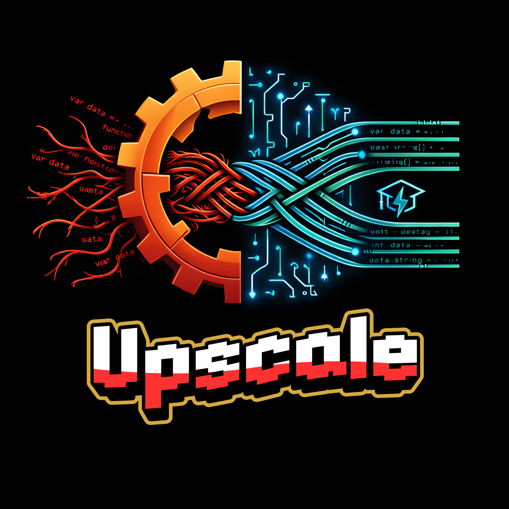

<table width="100%">
  <tr>
    <td align="center" width="200" style="background-color: #1a1a1a; border: none; border-radius: 12px;">
      
    </td>
    <td style="background-color: #1a1a1a; border: none; padding-left: 25px;">
      <h1>Upscale: Auto-Refactor & Upskill</h1>
      <p>
              

        
   </p>
<p>
        ᴛʜᴇ sᴏғᴛᴡᴀʀᴇ ɪɴᴅᴜsᴛʀʏ ᴍᴏᴠᴇs ғᴀsᴛ. ᴅᴏɴ'ᴛ ɢᴇᴛ ʟᴇғᴛ ʙᴇʜɪɴᴅ. ʟᴏᴏᴍ ᴇᴠᴏʟᴠᴇs ʏᴏᴜʀ ʟᴇɢᴀᴄʏ ʟᴏɢɪᴄ ɪɴᴛᴏ ғᴜᴛᴜʀᴇ-ᴘʀᴏᴏғ ᴀʀᴄʜɪᴛᴇᴄᴛᴜʀᴇ, ᴇɴsᴜʀɪɴɢ ʏᴏᴜʀ ᴄᴏᴅᴇ ɪs ᴀs ᴍᴏᴅᴇʀɴ ᴀs ʏᴏᴜʀ ɪᴅᴇᴀs.
      </p>
      <p>
        
      </p>
    </td>
  </tr>
</table>

---

# Upscale

Highlight a line of code. Get an instant suggestion to improve it.

## Team Setup (Read This First)

### Prerequisites

- [Node.js](https://nodejs.org/) v18+ — check with `node -v`
- [VS Code](https://code.visualstudio.com/)
- An LLM API key (TBD) — get one at [console.anthropic.com](https://console.anthropic.com)

### Clone and Install

```bash
git clone https://github.com/nadashawerr/code-upscale-extension.git
cd code-upscale-extension
npm install
```

### Compile

```bash
- npm run compile
```

### Run the Extension

Press **F5** in VS Code (or **fn + F5** on Mac if F5 doesn't work).

This opens a second VS Code window called the **Extension Development Host**. Your extension is live in that window. Test everything in there, not in your main window.

To stop it: **Shift + F5**, or just close the second window.

### Configure the Extension

In the Extension Development Host window:

1. Open **Settings** (`Cmd+,` on Mac / `Ctrl+,` on Windows)
2. Search for **Upscale**
3. Fill in:

| Setting                        | What to put         |
| ------------------------------ | ------------------- |
| `Upscale-team: Gemini Api Key` | Your Gemini API key |

---

## Project Structure

Each person owns one file. Don't edit someone else's file without checking with them first.

```bash
src/
├── extension.ts
├── types.ts
├── lineContext.ts
├── llm.ts
└── ui.ts
```

---

## Git Workflow

```bash
git checkout -b yourname/feature
git add .
git commit -m "feat: what you did"
git push origin yourname/feature
```

Open a PR, Person 1 merges into main. Never push directly to main.

---

## Heads Up

- Run `npm run compile` after every change, or use `npm run watch` to auto-compile on save
- If your changes aren't showing, recompile and restart the extension host (Shift+F5 → F5)
- Test your file with hardcoded fake data — you don't need the full pipeline to work on your piece

## Types

Everyone imports from `src/types.ts`. Do not redefine these anywhere else.

- **Person 1** — uses both `LineContext` and `Suggestion` in `extension.ts`
- **Person 2** — returns a `LineContext` from `getLineContext()`
- **Person 3** — receives a `LineContext` in `explainLine()`
- **Person 4** — receives a `LineContext`, returns a `Suggestion` in `getSuggestion()`
- **Person 5** — receives a `Suggestion` in `showSuggestion()`

Example:

```typescript
import { LineContext, Suggestion } from "./types";
```

## Release Notes

### 1.0.0

Initial release of Upscale
